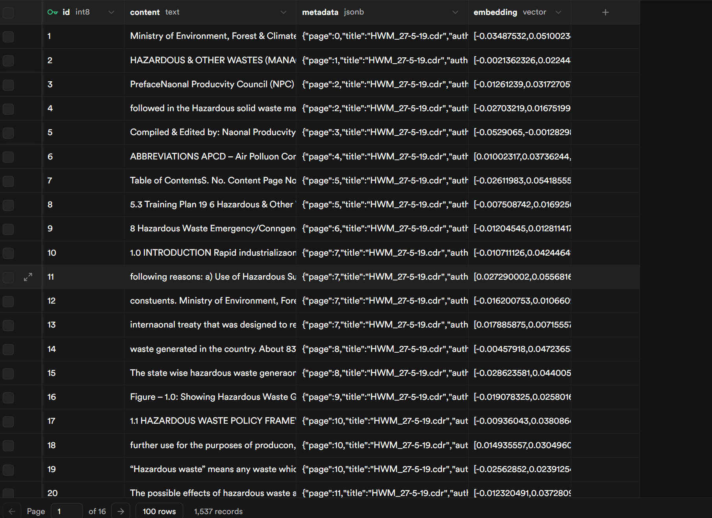

# EcoShield Compliance Agent 🌱

EcoShield is an autonomous, **Agentic Retrieval-Augmented Generation (RAG)** platform designed to help Small and Medium Enterprises (SMEs) and micro-factory operators instantly verify their environmental compliance against complex local regulations. 

By simply inputting a list of industrial byproducts or dropping a chemical manifest, the agent dynamically searches thousands of pages of Indian Environmental Law and synthesizes a strict, step-by-step compliance action plan.

## 🎯 Alignment to UN SDGs
This project directly targets the **1M1B (1 Million for 1 Billion)** initiative's sustainability criteria:
- **SDG 12 (Responsible Consumption and Production):** Ensures industrial byproducts (like Zinc Sludge and E-waste) are legally and safely disposed of.
- **SDG 6 (Clean Water and Sanitation):** Forces factories to cross-reference their toxic outputs with local Effluent Treatment Plant (ETP) regulations to prevent aquatic contamination.

---

## 🧠 The Multi-Model Cloud Architecture

To achieve maximum accuracy and zero latency, EcoShield utilizes a split-brain Multi-Model architecture, orchestrating the best models from different cloud providers.

### 1. Data Ingestion (IBM Granite)
We utilized **IBM Granite's Multilingual Embedding Model** (`ibm/granite-embedding-278m-multilingual`) to vectorize over 1,300 pages of dense legal PDFs. IBM Granite excels at capturing the high-dimensional semantic meaning of complex legal jargon.

*Note: Due to the extreme size of the dataset (1,300+ pages / 1,275 vector chunks), vectorizing the laws entirely consumed the IBM Watsonx Free Tier API token quota. To ensure the application remains perfectly functional and free to use for live demonstrations, the real-time reasoning engine was securely migrated to Google.*

### 2. Real-Time Reasoning (Google Gemini 2.5 Flash)
While IBM handles the heavy-duty data ingestion, the real-time logic and synthesis are driven by **Google Gemini 2.5 Flash**. Gemini acts as the "Agentic Brain," executing three distinct steps in milliseconds:
1. **Extraction:** Identifies specific hazardous materials from messy human input.
2. **Formulation:** Writes a mathematical semantic search query tailored to the factory's location.
3. **Synthesis:** Reads the retrieved legal text and outputs a strict JSON action plan.

### 3. Persistent Vector Storage (Supabase)
All embeddings are stored in a **Supabase pgvector** PostgreSQL database. This allows the backend to perform blazing-fast Cosine Similarity searches, pulling the exact legal clauses required to answer the user's prompt in real-time.


*(Screenshot: Successfully ingested 1,537 records of high-dimensional legal vectors into the Supabase pgvector database.)*

---

## 📚 The Legal Dataset

We aggregated and ingested several massive, real-world Indian Environmental Law textbooks and policy documents to give the AI its legal foundation:

1. [`2015.474253.Environmental-Law.pdf`](./backend/data/policies/2015.474253.Environmental-Law.pdf) (Comprehensive Environmental Textbook)
2. [`Hazardous-waste-management-rules-2016.pdf`](./backend/data/policies/Hazardous-waste-management-rules-2016.pdf) (Govt of India Official Gazette)
3. [`Indian-Environmental-Law_Key-Concepts-and-Principles.pdf`](./backend/data/policies/Indian-Environmental-Law_Key-Concepts-and-Principles.pdf) (Core Compliance Principles)
4. [`smallbusinessresourcesinfosheet092025.pdf`](./backend/data/policies/smallbusinessresourcesinfosheet092025.pdf) (SME Guidelines)

---

## 🛡️ Responsible AI & Enterprise Features

1. **Anti-Hallucination Guardrails:** The LLM prompt explicitly restricts the agent to synthesize answers *strictly* based on the retrieved context from Supabase, preventing it from inventing fake laws.
2. **Native Export Capabilities:** SME owners can instantly **Copy to Clipboard** or **Download as PDF**. The PDF generation uses native `window.print()` with custom Tailwind print stylesheets for zero-dependency, ultra-fast document rendering.
3. **Client-Side Caching:** The Next.js dashboard utilizes a custom React Cache. If a user submits an identical request, the UI instantly loads the cached JSON blueprint, completely eliminating duplicate API calls and protecting the Gemini token quota.
4. **PII Scrubbing:** The backend automatically redacts simulated personally identifiable information (PII) before sending payloads to external cloud LLMs.

## 🚀 How to Run Locally

1. **Start the FastAPI Backend**
   ```bash
   cd backend
   python -m venv venv
   .\venv\Scripts\activate
   pip install -r requirements.txt
   uvicorn main:app --reload
   ```

2. **Start the Next.js Frontend**
   ```bash
   cd frontend
   npm install
   npm run dev
   ```

Open `http://localhost:3000` to interact with the EcoShield Agent.
